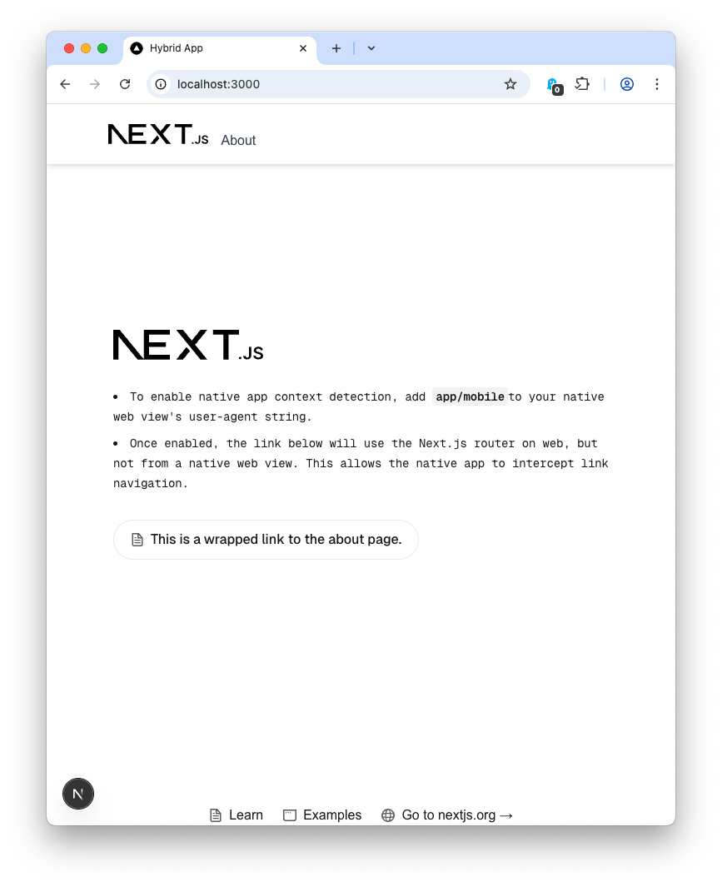
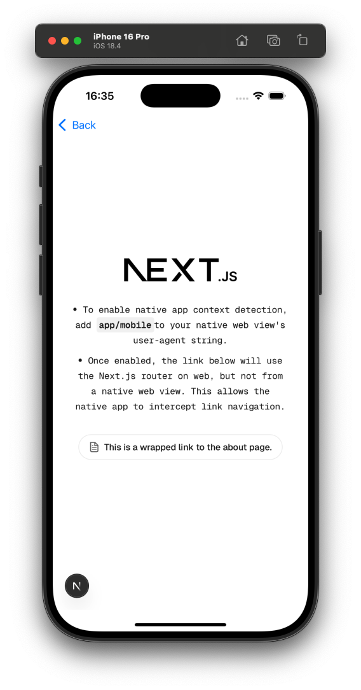
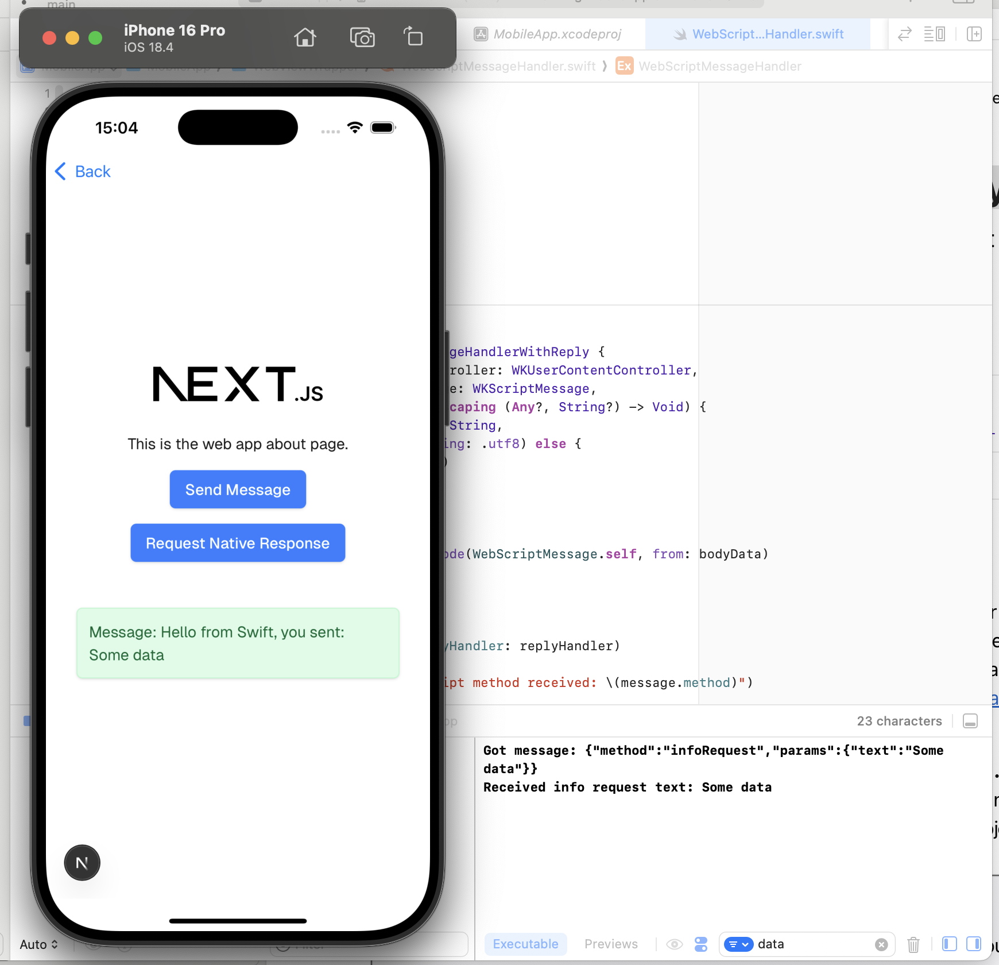

# Hybrid mobile/web App Architecture Example

This project is an example of how to build a hybrid native + web-based mobile application.

It uses a combination of platform-native code and web views to display, and communicate with, pages from a Next.js web app.

<figure>
  
  <figcaption><em>Web app running in the browser (note header and footers visible)</em></figcaption>
</figure>

<figure>
  
  <figcaption><em>Web app running in an embedded native web view on iOS (note header and footer are hidden).</em></figcaption>
</figure>

## Overview

The hybrid architecture is useful for rapid development of mobile apps that can use as much (or as little) of an existing web frontend as required.

The web app and native code communicate through the use of the [Channel Messaging API](https://developer.mozilla.org/en-US/docs/Web/API/Channel_Messaging_API). This allows for marshalling data between native code and the browser's runtime.

This is useful for sharing state, such as authentication or session tokens, across the two contexts.

For more details of the capabilities and mechanisms see the [technical information](#technical-information) section below.

## Project Structure

The project consists of two parts:

1. A Next.js web app ([./web](./web))
2. A native, Swift-based iOS app ([./mobile-ios](./mobile-ios))

## Running the Example Locally

### Pre-requisites

* Node + pnpm
* Xcode 16

### 1. Build and serve the web + frontend

```
$ cd web
$ pnpm run dev 
```

Web app will be avilable at: [localhost:3000](http://localhost:3000)

### 2. Build and run the app in Xcode

* Open `./mobile-ios/MobileApp.xcodeproj` in Xcode, then
* run the `MobileApp` scheme on an iOS simulator.

## Technical Information

### Native Mobile App Context Detection

The web app uses the presence of pre-defined user agent string `nativeMobileAppUserAgent` to detect if it is running in a native mobile web view context or not.

In our example, this has the value `mobile/app`. For details of how this is added to the user agent on iOS see [the WKWebKit wrapper view](./mobile-ios/MobileApp/WebViewWrapper/WebKitWrapperView.swift#L25).

Back on the web side of things, the custom react hook [`useAppInNativeMobileContext`](./web/src/hooks/useAppInNativeMobileContext.ts) can then be used from any component to render or behave conditionally depending on whether the web app is running in a web or native mobile web view.

Note: Any React component using this hook will need to declare `'use client'` at the top of the file to indicate that this logic can only run client-side.

### Next.js Link router bypass

When the Next.js router is in use, iOS web view navigation delegate methods are never invoked in native code.

To bypass this, the Next.js `Link` component is wrapped, see: [`WrappedLink`](./web/src/components/WrappedLink/WrappedLink.tsx).

The wrapped link uses standard links when in a native context, and the usual Next.js `Link` components when in a normal web context.

This component should be used for all links in the web app that may be visible to the native web view.

With link navigation interception working on the native side, navigation can then be routed to a native view if one exists for a given link.

### Hiding of components (such as header & footer)

React components can be hidden when rendering in a native mobile context, which is useful for hiding things like headers and footers (as these will be implemented in the native app), and preventing unwanted navigation to other parts of the main web app.

An example of doing this can be found in [the Header component](./web/src/components/Header/header.tsx) in this project.

Note: This implementation does result in a brief flash of the web header when first rendering, which is down to the way Next.js renders pages. This is considered an acceptable tradeoff.

### Message Passing

The web app uses the [Channel Messaging API](https://developer.mozilla.org/en-US/docs/Web/API/Channel_Messaging_API) to send RPC-like messages to the native host app.

An example request that is sent from the web app, and expects a response, is shown below:

```json
{
   "method": "infoRequest",
   "params": {
      "text": "Some data"
   }
}
```


On the web side `useMessageHandler.ts` is used to:

* Create a `MessagePort` object, which will be used for sending messages to the native context.

* For non-Safari (i.e. Android) web views, the React hook `useMessageEventListener` is used to register a handler method for received messages.

* This is not required for web views on iOS, as a callback is passed directly in the post message method call (as illustrated in the following from the `sendPostMessage` implementation):

	```typescript
	const response = await window.webkit.messageHandlers?.messageHandler?.postMessage(message)
	return callback?.(JSON.parse(response).result)
	```

* A post request can be sent using the `sendPostMessage` method:

	```typescript
    if (canSendPostMessage()) {
		await sendPostMessage('infoRequest', {'text': 'Some data'}, updateMessage)
    }
	```

On the native side:

* On iOS, the WebKit `WKScriptMessageHandlerWithReply` delegate `WebScriptMessageHandler`:
	1. Decodes the message, and 
	2. Issues the appropriate response to the callback, e.g.

	```swift
    let response = WebScriptResponse(method: "infoResponse", result: ["message": message])
    let responseString = String(data: try! JSONEncoder().encode(response), encoding: .utf8)
    replyHandler(responseString, nil)

	```

* Back on the web side again, this response is parsed in the callback/listener method and dealt with as needed.

#### Example

An example illustrating the message passing behaviour is included in the project, and is shown below.

<figure>
  
  <figcaption><em>Web app running in a <code>WKWebView</code> on iOS, making a request, and receiving a response from native code.</em></figcaption>
</figure>

* When the user taps the 'Request Native Response' button, the web app sends an `infoRequest` message, with an attached payload `Some data`.

* The Swift code then replies with a message that contains the originally passed-in payload.

* The web app receives this message and updates the original page to display the received response.

## License

This project is distributed under the terms of both the MIT license and the
Apache License (Version 2.0).

See [LICENSE-APACHE](LICENSE-APACHE) and [LICENSE-MIT](LICENSE-MIT), and for
details.
